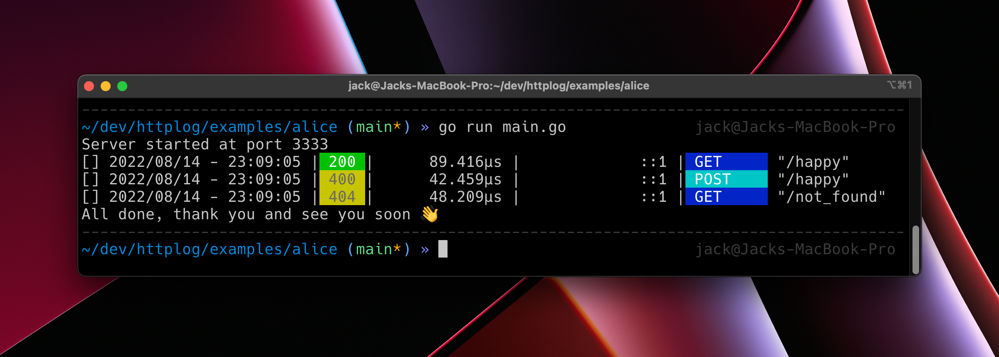
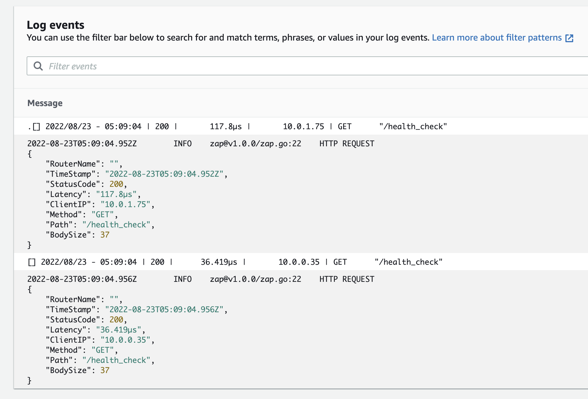
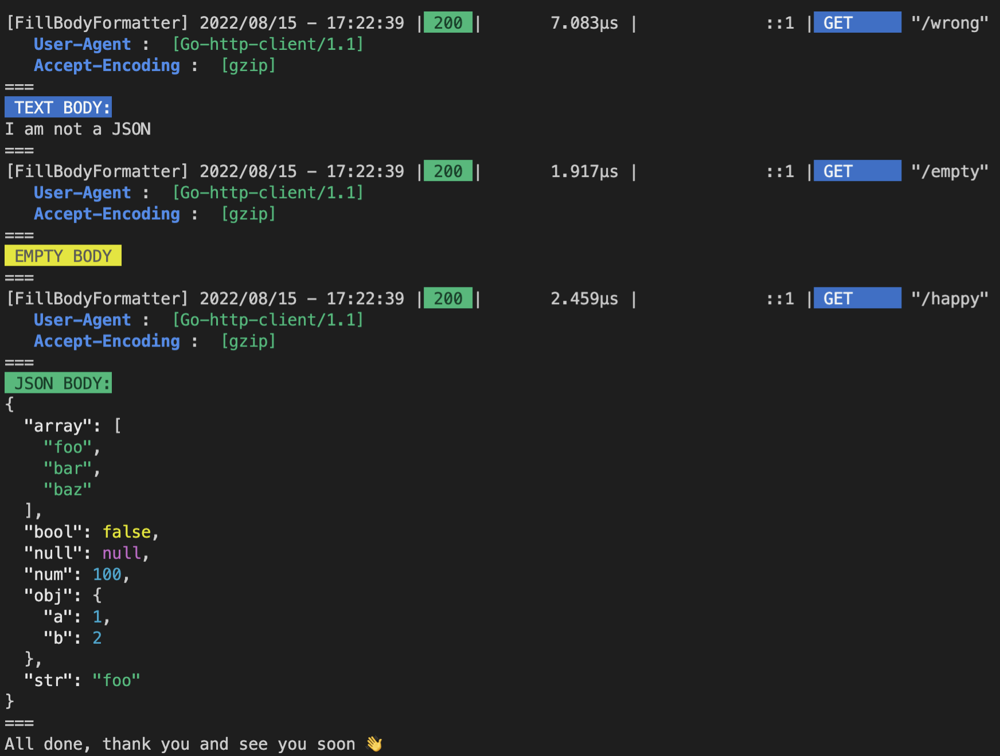
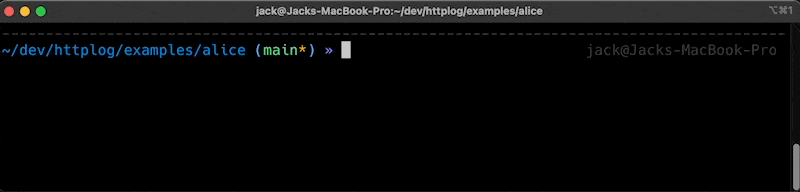

# Beautiful logger for http

Proudly created and supported by [MadAppGang](https://madappgang.com) company.

[](https://pkg.go.dev/github.com/MadAppGang/httplog)
[](https://goreportcard.com/report/github.com/MadAppGang/httplog)
[](https://codecov.io/gh/MadAppGang/httplog)

## Why?

Every single web framework has a build-in logger already, why do we need on more?
The question is simple and the answer is not.

The best logger is structured logger, like [Uber Zap](https://github.com/uber-go/zap). Structure logs are essentials today to help collect and analyze logs with monitoring tools like ElasticSearch or DataDog.

But what about humans? Obviously you can go to your monitoring tool and parse your structured logs. But what about seeing human readable logs in place just in console? Although you can read JSON, it is extremely hard to find most critical information in the large JSON data flow.

Httplog package brings good for humans and log collection systems, you can use tools like zap to create structured logs and see colored beautiful human-friendly output in console in place. Win-win for human and machines 🤖❤️👩🏽‍💻

Nice and clean output is critical for any web framework. Than is why some people use go web frameworks just to get beautiful logs.

This library brings you fantastic http logs to any web framework, even if you use native `net/http` for that.

But it's better to see once, here the default output you will get with couple of lines of code:



And actual code looks like this:

```go
  func main() {
    // setup routes
    http.Handle("/happy", httplog.Logger(happyHandler))
    http.Handle("/not_found", httplog.Logger(http.NotFoundHandler()))

    //run server
    _ = http.ListenAndServe(":3333", nil)
  }
```

All you need is wrap you handler with `httplog.Logger` and the magic happens.

And this is how the structured logs looks in AWS CloudWatch. As you can see, the color output looks not as good here as in console. But JSON structured logs are awesome 😍



Here is a main features:

- framework agnostic (could be easily integrated with any web framework), you can find `examples` for:
  - [alice](https://github.com/MadAppGang/httplog/blob/main/examples/alice/main.go)
  - [chi](https://github.com/MadAppGang/httplog/blob/main/examples/chi/main.go)
  - [echo](https://github.com/MadAppGang/httplog/blob/main/examples/echo/main.go)
  - [gin](https://github.com/MadAppGang/httplog/blob/main/examples/gin/main.go)
  - [goji](https://github.com/MadAppGang/httplog/blob/main/examples/goji/main.go)
  - [gorilla mux](https://github.com/MadAppGang/httplog/blob/main/examples/gorilla/main.go)
  - [httprouter](https://github.com/MadAppGang/httplog/blob/main/examples/httprouter/main.go)
  - [mojito](https://github.com/MadAppGang/httplog/blob/main/examples/mojito/main.go)
  - [negroni](https://github.com/MadAppGang/httplog/blob/main/examples/negroni/main.go)
  - [native net/http](https://github.com/MadAppGang/httplog/blob/main/examples/nethttp/main.go)
  - not found yours? let us know and we will add it
- response code using special wrapper
- response length using special wrapper
- can copy response body
- get real user IP for Google App Engine
- get real user IP for CloudFront
- get real user IP for other reverse proxy which implements [RFC7239](https://www.rfc-editor.org/rfc/rfc7239.html)
- customize output format
- has the list of routes to ignore
- build in structure logger integration
- callback function to modify response before write back (add headers or do something)

This framework is highly inspired by [Gin logger](https://github.com/gin-gonic/gin/blob/master/logger.go) library, but has not Gin dependencies at all and has some improvements.
Httplog has only one dependency at all: `github.com/mattn/go-isatty`. So it's will not affect your codebase size.

## Custom format

You can modify formatter as you want. Now there are two formatter available:

- `DefaultLogFormatter`
- `ShortLogFormatter`
- `HeadersLogFormatter`
- `DefaultLogFormatterWithHeaders`
- `BodyLogFormatter`
- `DefaultLogFormatterWithHeadersAndBody`
- `RequestHeaderLogFormatter`
- `DefaultLogFormatterWithRequestHeader`
- `RequestBodyLogFormatter`
- `DefaultLogFormatterWithRequestHeadersAndBody`
- `FullFormatterWithRequestAndResponseHeadersAndBody`

And you can combine them using `ChainLogFormatter`.

Here is an example of formatter in code:

```go
// Short log formatter
shortLoggedHandler := httplog.LoggerWithFormatter(
  httplog.ShortLogFormatter,
  wrappedHandler,
)
```

You can define your own log format. Log formatter is a function with a set of precalculated parameters:

```go
// Custom log formatter
customLoggedHandler := httplog.LoggerWithFormatter(
  // formatter is a function, you can define your own
  func(param httplog.LogFormatterParams) string {
    statusColor := param.StatusCodeColor()
    resetColor := param.ResetColor()
    boldRedText := "\033[1;31m"

    return fmt.Sprintf("🥑[I am custom router!!!] %s %3d %s| size: %10d bytes | %s %#v %s 🔮👨🏻‍💻\n",
      statusColor, param.StatusCode, resetColor,
      param.BodySize,
      boldRedText, param.Path, resetColor,
    )
  },
  happyHandler,
)
http.Handle("/happy_custom", customLoggedHandler)
```

For more details and how to capture response body please look in the [example app](https://github.com/MadAppGang/httplog/blob/main/examples/custom_formatter/main.go).

params is a type of LogFormatterParams and the following params available for you:

| param | description |
| --- | --- |
| Request | `http.Request` instance |
| RouterName | when you create logger, you can specify router name |
| Timestamp | TimeStamp shows the time after the server returns a response |
| StatusCode | StatusCode is HTTP response code |
| Latency | Latency is how much time the server cost to process a certain request |
| ClientIP | ClientIP calculated real IP of requester, see Proxy for details |
| Method | Method is the HTTP method given to the request |
| Path | Path is a path the client requests |
| BodySize | BodySize is the size of the Response Body |
| Body | Body is a body content, if body is copied |

## Integrate with structure logger

Good and nice output is good, but as soon as we have so much data about every response it is a good idea to pass it to our application log structured collector.

One of the most popular solution is [Uber zap](https://github.com/uber-go/zap).
You can use any structured logger you want, use zap's integration example as a reference.

All you need is create custom log formatter function with your logger integration.
This repository has this formatter for zap created and you can use it importing `github.com/MadAppGang/httplog/zap`:

```go
logger := httplog.LoggerWithConfig(
  httplog.LoggerConfig{
    Formatter:  lzap.DefaultZapLogger(zapLogger, zap.InfoLevel, ""),
  },
  http.HandlerFunc(handler),
)
http.Handle("/happy", logger)
```

You can find full-featured [example in zap integration folder](https://github.com/MadAppGang/httplog/blob/main/examples/zap/main.go).

## Customize log output destination

You can use any output you need, your output must support `io.Writer` protocol.
After that you need init logger:

```go
buffer := new(bytes.Buffer)
logger := LoggerWithWriter(buffer, handler) //all output is written to buffer
```

## Care about secrets. Skipping path and masking headers

Some destinations should not be logged. For that purpose logger config has `SkipPaths` property with array of strings. Each string is a Regexp for path you want to skip. You can write exact path to skip, which would be valid regexp, or you can use regexp power:

```go

logger := LoggerWithConfig(LoggerConfig{
  SkipPaths: []string{
    "/skipped",
    "/payments/\\w+",
    "/user/[0-9]+",
  },
}, handler)


The other feature to safe your logs from leaking secrets is Header masking. For example you do not want to log Bearer token header, but it is  useful to see it is present and not empty.

For this purpose `LoggerConfig` has field `HideHeaderKeys` which works the same as `SkipPaths`. Just feed an array of case insensitive key names regexps like that:

```go

logger := LoggerWithConfig(LoggerConfig{
  HideHeaderKeys: []string{
    "Bearer",
    "Secret-Key",
    "Cookie",
  },
}, handler)

```

If regexp is failed to compile, the logger will skip and and it will write the message to the log output destination.

## Use GoogleApp Engine or CloudFlare

You application is operating behind load balancers and reverse proxies. That is why origination IP address is changing on every hop.
To save the first sender's IP (real user remote IP) reverse proxies should save original IP in request headers.
Default headers are `X-Forwarded-For` and `X-Real-IP`.

But some clouds have custom headers, like Cloudflare and Google Apps Engine.
If you are using those clouds or have custom headers in you environment, you can handle that by using custom `Proxy` init parameters:

```go
httplog.LoggerWithConfig(
  httplog.LoggerConfig{
    ProxyHandler: NewProxyWithType(httpdlog.ProxyGoogleAppEngine),
  },
http.HandlerFunc(h),
```

or if you have your custom headers:

```go
logger := httplog.LoggerWithConfig(
  httplog.LoggerConfig{
    ProxyHandler: NewProxyWithTypeAndHeaders(
      httpdlog.ProxyDefaultType,
      []string{"My-HEADER-NAME", "OTHER-HEADER-NAME"}
    ),
  },
  handler,
)

```

## How to save request body and headers

You can capture response data as well. But please use it in dev environments only, as it use extra resources and produce a lot of output in terminal. Example of body output [could be found here](https://github.com/MadAppGang/httplog/blob/main/examples/body_formatter/main.go).



You can use `DefaultLogFormatterWithHeaders` for headers output or `DefaultLogFormatterWithHeadersAndBody` to output response body. Don't forget to set `CaptureBody` in LoggerParams.

You can combine your custom Formatter and `HeadersLogFormatter` or/and `BodyLogFormatter` using `ChainLogFormatter`:

```go
var myFormatter = httplog.ChainLogFormatter(
  MyLogFormatter,
  httplog.HeadersLogFormatter,
  httplog.BodyLogFormatter,
)
```

## Integration examples

Please go to examples folder and see how it's work:



### Native `net/http` package

This package is suing canonical golang approach, and it easy to implement it with all `net/http` package.

```go
http.Handle("/not_found", httplog.Logger(http.NotFoundHandler()))
```

Full example [could be found here](https://github.com/MadAppGang/httplog/blob/main/examples/nethttp/main.go).

### Alice middleware

Alice is a fantastic lightweight framework to chain and manage middlewares. As Alice is using canonical approach, it is working with httplog out-of-the-box.

You don't need any wrappers and you can user logger directly:

```golang

.....
chain := alice.New(httplog.Logger, nosurf.NewPure)
mux.Handle("/happy", chain.Then(happyHandler()))
```

Full example [could be found here](https://github.com/MadAppGang/httplog/blob/main/examples/alice/main.go).

### Chi

Chi is a router which uses the standard approach as `Alice` package.

You don't need any wrappers and you can user logger directly:

```go

r := chi.NewRouter()
r.Use(httplog.Logger)
r.Get("/happy", happyHandler)
...

Full example [could be found here](https://github.com/MadAppGang/httplog/blob/main/examples/chi/main.go).

```

### Echo

Echo middleware uses internal `echo.Context` to manage request/responser flow and middleware management.

As a result, `echo` creates it's own http.ResponseWriter wrapper to catch all written data.
That is why `httplog` could not handle it automatically.

All you need is create wrapper, which set the response status and size manually from `echo's` response writer wrapper.

```go
func loggerMiddleware(next echo.HandlerFunc) echo.HandlerFunc {
  return func(c echo.Context) error {
    logger := httplog.Logger(http.HandlerFunc(func(rw http.ResponseWriter, r *http.Request) {
      if err := next(c); err != nil {
]      c.Error(err)
      }
      // echo is overwriting http.ResponseWriter to proxy data write (c.Response() as echo.Response type)
      // we just need manually bring this data back to our log's response writer (rw variable)
      lrw, _ := rw.(httplog.ResponseWriter)
      lrw.Set(c.Response().Status, int(c.Response().Size))
    }))

    logger.ServeHTTP(c.Response().Writer, c.Request())
    return nil
  }
}

//use this as native echo middleware:
e := echo.New()
e.Use(loggerMiddleware)11
e.GET("/happy", happyHandler)
```

Full example [could be found here](https://github.com/MadAppGang/httplog/blob/main/examples/echo/main.go).

### Gin

Gin has the most beautiful log output. That is why this package has build highly inspired by `Gin's` logger.

If you missing some features of Gin's native logger and want to use this one, it is still possible.

Gin middleware uses internal `gin.Context` to manage request/responser flow and middleware management. The same approach as `Echo`.

That is why we created `httplog`, to bring this fantastic logger to native golang world :-)

`Gin` creates it's own http.ResponseWriter wrapper to catch all written data.
That is why `httplog` could not handle it automatically.

All you need is create wrapper, which set the response status and size manually from `Gin's` response writer wrapper.

```go
// httplog.ResponseWriter is not fully compatible with gin.ResponseWriter
func LoggerMiddleware() gin.HandlerFunc {
  return func(c *gin.Context) {
    l := httplog.Logger(http.HandlerFunc(func(rw http.ResponseWriter, r *http.Request) {
      // gin uses wrapped ResponseWriter, we don't want to replace it
      // as gin use custom middleware approach with Next() method and context
      c.Next()
      // set result for ResponseWriter manually
      rwr, _ := rw.(httplog.ResponseWriter)
      rwr.Set(c.Writer.Status(), c.Writer.Size())
    }))
    l.ServeHTTP(c.Writer, c.Request)
  }
}

//Use now this wrapper as native middleware
r := gin.New()
r.Use(LoggerMiddleware())
r.GET("/happy", happyHandler)
```

Full example [could be found here](https://github.com/MadAppGang/httplog/blob/main/examples/gin/main.go).

### Goji

Goji is using canonical middleware approach, that is why it is working with httplog out-of-the-box.

You don't need wrappers or anything like that.

```go
mux := goji.NewMux()
mux.Handle(pat.Get("/happy"), httplog.Logger(happyHandler))
```

Full example [could be found here](https://github.com/MadAppGang/httplog/blob/main/examples/goji/main.go).

### Gorilla

Gorilla mux is one of the most loved muxer/router.
Gorilla is using canonical middleware approach, that is why it is working with httplog out-of-the-box.

You don't need to create any wrappers:

```go

r := mux.NewRouter()
r.HandleFunc("/happy", happyHandler)
r.Use(httplog.Logger)

```

Full example [could be found here](https://github.com/MadAppGang/httplog/blob/main/examples/gorilla/main.go).

### HTTPRouter

To use HTPPRouter you need to create simple wrapper. As HTTPRouter using custom `httprouter.Handler` and additional argument with params in handler function.

```go
func LoggerMiddleware(h httprouter.Handle) httprouter.Handle {
  return func(w http.ResponseWriter, r *http.Request, ps httprouter.Params) {
    logger := httplog.Logger(http.HandlerFunc(func(w http.ResponseWriter, r *http.Request) {
      h(w, r, ps)
    }))
    logger.ServeHTTP(w, r)
  }
}

//use as native middleware
router := httprouter.New()
router.GET("/happy", LoggerMiddleware(happyHandler))
```

Full example [could be found here](https://github.com/MadAppGang/httplog/blob/main/examples/httprouter/main.go).

### Mojito
Because Go-Mojito uses dynamic handler functions, which include support for net/http types, httplog works out-of-the-box:  

```go
mojito.WithMiddleware(httplog.Logger)
mojito.GET("/happy", happyHandler)
```
Full example [could be found here](https://github.com/MadAppGang/httplog/blob/main/examples/mojito/main.go).

### Negroni

Negroni uses custom `negroni.Handler` as middleware. We need to create custom wrapper for that:

```go
var negroniLoggerMiddleware negroni.Handler = negroni.HandlerFunc(func(rw http.ResponseWriter, r *http.Request, next http.HandlerFunc) {
  logger := httplog.Logger(next)
  logger.ServeHTTP(rw, r)
})

//use it as native middleware:
n := negroni.New()
n.Use(negroniLoggerMiddleware)
n.UseHandler(mux)
```

Full example [could be found here](https://github.com/MadAppGang/httplog/blob/main/examples/negroni/main.go).
